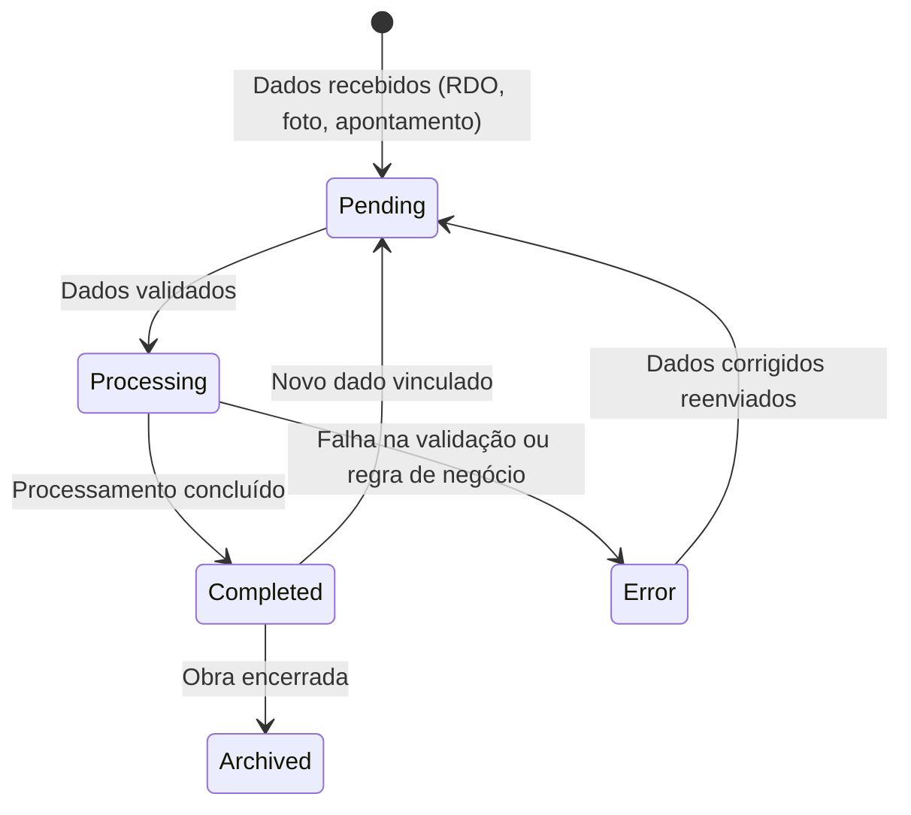

# Requisitos Funcionais — LARY AI

> Sistema de Inteligência Artificial aplicado à Construção Civil.
> Status: **Concepção** | Maturidade: 1/5

---

## 1. Introdução

Este documento formaliza os requisitos funcionais do LARY AI, extraídos a partir do perfil do agente ideal descrito no documento de visão. O sistema deve atuar como um especialista multidisciplinar cobrindo engenharia civil, discovery de produto, gestão de produto, IA, arquitetura de software, UX para operações de campo, compliance, risco, vendas B2B e estratégia financeira.

---

## 2. User Stories Detalhadas

### 2.1 Especialista em Construção Civil

| ID | User Story | Critério de Aceitação |
|---|---|---|
| US‑CIV‑001 | Como LARY AI, devo processar **RDOs** (Registro Diário de Obras) extraindo dados estruturados de textos, fotos e planilhas. | RDO processado com ≥95% de acerto nos campos: data, clima, equipe, atividades, ocorrências. |
| US‑CIV‑002 | Como LARY AI, devo gerar e manter o **Diário de Obra** digital consolidando RDOs e eventos. | Diário disponível em tempo real com linha do tempo navegável por data. |
| US‑CIV‑003 | Como LARY AI, devo processar o **cronograma físico-financeiro** (curva S) e detectar desvios automaticamente. | Alertas emitidos quando desvio >5% entre planejado vs. realizado. |
| US‑CIV‑004 | Como LARY AI, devo calcular e monitorar o **caminho crítico** do planejamento da obra. | Atualização automática sempre que há alteração no cronograma. |
| US‑CIV‑005 | Como LARY AI, devo processar **medições de empreiteiros** e confrontar com cronograma e produtividade. | Relatório de medição com validação de quantidades e preços. |
| US‑CIV‑006 | Como LARY AI, devo controlar a **produtividade da mão de obra** por serviço, equipe e período. | Indicadores Hh/serviço calculados e comparados com referencial. |
| US‑CIV‑007 | Como LARY AI, devo realizar o **apontamento de mão de obra** por funcionário e serviço. | Registro individual com vínculo ao RDO e ao cronograma. |
| US‑CIV‑008 | Como LARY AI, devo gerir **materiais** (entrada, saída, estoque, consumo) por obra. | Saldo atualizado em tempo real; alerta de estoque mínimo. |
| US‑CIV‑009 | Como LARY AI, devo controlar **equipamentos** (disponibilidade, uso, manutenção, alocação). | Histórico de alocação e horas trabalhadas por equipamento. |
| US‑CIV‑010 | Como LARY AI, devo registrar e acompanhar **não conformidades** e planos de ação. | Prazo de fechamento monitorado; escalonamento automático se vencido. |
| US‑CIV‑011 | Como LARY AI, devo monitorar **segurança do trabalho** (EPIs, treinamentos, acidentes, DDS). | Dashboard de indicadores de segurança com alertas. |
| US‑CIV‑012 | Como LARY AI, devo classificar e associar **evidências fotográficas** aos registros do diário de obra. | Fotos georreferenciadas e vinculadas a RDO, data e local. |

### 2.2 Especialista em Product Discovery

| ID | User Story | Critério de Aceitação |
|---|---|---|
| US‑DSC‑001 | Como LARY AI, devo identificar **dores financeiramente quantificáveis** nos processos da obra. | Toda dor mapeada possui valor financeiro estimado em R$. |
| US‑DSC‑002 | Como LARY AI, devo diferenciar **problemas frequentes** de reclamações pontuais via análise estatística. | Classificação automática com frequência, impacto e recorrência. |
| US‑DSC‑003 | Como LARY AI, devo conduzir **entrevistas com stakeholders** simuladas ou assistidas por IA. | Roteiro gerado dinamicamente; respostas sumarizadas e categorizadas. |
| US‑DSC‑004 | Como LARY AI, devo **mapear a jornada do usuário** da obra (engenheiro, encarregado, almoxarife, fiscal). | Jornada desenhada com pontos de atrito, tempos e oportunidades. |
| US‑DSC‑005 | Como LARY AI, devo descobrir **gargalos operacionais** nos fluxos de campo. | Gargalo identificado com causa raiz, impacto e sugestão. |
| US‑DSC‑006 | Como LARY AI, devo **medir o valor percebido** de cada funcionalidade junto aos usuários. | Score de satisfação e NPS por funcionalidade. |

### 2.3 Especialista em Gestão de Produto

| ID | User Story | Critério de Aceitação |
|---|---|---|
| US‑PRD‑001 | Como LARY AI, devo priorizar o backlog de funcionalidades com base em valor de negócio vs. esforço. | Matriz de priorização atualizada a cada sprint. |
| US‑PRD‑002 | Como LARY AI, devo gerar **OKRs e KPIs** para o produto e para cada obra. | OKRs propostos com baseline e meta trimestral. |
| US‑PRD‑003 | Como LARY AI, devo propor **experimentos** (A/B, testes de usabilidade) para validar hipóteses. | Desenho do experimento com duração, amostra e critério de sucesso. |

### 2.4 Especialista em Inteligência Artificial & Arquitetura de Software

| ID | User Story | Critério de Aceitação |
|---|---|---|
| US‑AI‑001 | Como LARY AI, devo processar linguagem natural em português (voz e texto) para comandos e consultas da obra. | Comandos em linguagem coloquial da construção civil interpretados com precisão. |
| US‑AI‑002 | Como LARY AI, devo utilizar **visão computacional** para análise de fotos de obra (progresso, segurança, materiais). | Fotografias analisadas: detecção de objetos, pessoas, EPIs. |
| US‑AI‑003 | Como LARY AI, devo operar com **arquitetura modular** (microserviços ou monólito modular) para escalabilidade. | Módulos independentes com contratos de API bem definidos. |
| US‑AI‑004 | Como LARY AI, devo suportar **modo offline** para operação em campo sem conectividade. | Sincronização automática ao restabelecer conexão. |
| US‑AI‑005 | Como LARY AI, devo oferecer **APIs REST/GraphQL** para integração com sistemas legados. | Documentação OpenAPI disponível e versionada. |

### 2.5 Especialista em UX para Operações de Campo

| ID | User Story | Critério de Aceitação |
|---|---|---|
| US‑UX‑001 | Como LARY AI, devo oferecer uma **interface mobile-first** otimizada para uso em campo (tablet/smartphone). | Todos os fluxos principais funcionais em tela ≥5" com toque. |
| US‑UX‑002 | Como LARY AI, devo suportar **interação por voz** para preenchimento de dados com mãos ocupadas. | Entrada por voz com transcrição e confirmação. |
| US‑UX‑003 | Como LARY AI, devo funcionar com **UI de baixo esforço** (mínimos cliques, auto-preenchimento, seleção). | UX auditada com tempo médio por tarefa reduzido. |

### 2.6 Especialista em Compliance e Risco

| ID | User Story | Critério de Aceitação |
|---|---|---|
| US‑CMP‑001 | Como LARY AI, devo garantir **conformidade legal** dos registros (RDO, medições, segurança) com NRs e legislação. | Checklist de compliance por tipo de registro. |
| US‑CMP‑002 | Como LARY AI, devo gerar alertas de **risco** contratual, trabalhista e fiscal automaticamente. | Risco classificado (baixo/médio/alto) com ação recomendada. |
| US‑CMP‑003 | Como LARY AI, devo manter **audit trail** (trilha de auditoria) de todas as alterações e acessos. | Log imutável com timestamp, usuário, ação e valor anterior. |

---

## 3. Requisitos de Dados e Armazenamento

### 3.1 Schema Conceitual Estendido

```txt
OBRA (ID_Obra PK, Nome_Obra, Tipo_Obra, Data_Inicio, Data_Fim, 
       Endereco, Orcamento_Total, Status)

RDO (ID_RDO PK, ID_Obra FK, Data_RDO, Turno, Clima, 
     Conteudo_RDO, ID_Usuario_Registro FK, Data_Criacao)

DIARIO_OBRA (ID_Diario PK, ID_Obra FK, Data, Texto_Consolidado, 
             ID_RDO_Origem FK)

CRONOGRAMA (ID_Cronograma PK, ID_Obra FK, Servico, Data_Inicio, 
            Data_Fim, Percentual_Planejado, Percentual_Realizado, 
            Valor_Planejado, Valor_Realizado)

CAMINHO_CRITICO (ID_Caminho PK, ID_Obra FK, Sequencia_Servicos, 
                 Folga_Total)

MEDICAO_EMPREITEIRO (ID_Medicao PK, ID_Obra FK, ID_Empreiteiro FK, 
                     Periodo, Valor_Medido, Valor_Aprovado, Status)

PRODUTIVIDADE (ID_Produtividade PK, ID_Obra FK, Servico, Equipe, 
               Periodo, Hh_Realizados, Quantidade_Servicos, 
               Indice_Produtividade)

APONTAMENTO_MAO_OBRA (ID_Apontamento PK, ID_Obra FK, 
                       ID_Funcionario FK, ID_Servico FK, 
                       Data, Horas_Trabalhadas, Atividade)

MATERIAL (ID_Material PK, ID_Obra FK, Nome_Material, 
          Quantidade_Entrada, Quantidade_Saida, Saldo_Atual, 
          Unidade, Estoque_Minimo)

EQUIPAMENTO (ID_Equipamento PK, ID_Obra FK, Nome_Equipamento, 
             Horas_Trabalhadas, Status_Operacional, 
             Data_Ultima_Manutencao)

NAO_CONFORMIDADE (ID_NC PK, ID_Obra FK, Descricao, Gravidade, 
                  Prazo_Fechamento, Responsavel, Status, 
                  Plano_Acao)

SEGURANCA (ID_Seguranca PK, ID_Obra FK, Tipo_Registro, 
           Descricao, Data, Responsavel)

EVIDENCIA_FOTOGRAFICA (ID_Foto PK, ID_Obra FK, ID_RDO FK, 
                       URL_Imagem, Latitude, Longitude, 
                       Data_Hora, Tags_Classificacao)

USUARIO (ID_Usuario PK, Nome_Usuario, Email, Perfil, 
         ID_Obra_Alocada FK)

FEEDBACK (ID_Feedback PK, ID_Usuario FK, 
          ID_Funcionalidade FK, Score_Satisfacao, 
          Comentario, Data)
```

### 3.2 Requisitos de Armazenamento

| ID | Requisito | Descrição |
|---|---|---|
| DAT‑001 | **Armazenamento de imagens** | Repositório escalável para fotos de obra (blob/S3) com compressão automática. |
| DAT‑002 | **TimescaleDB para séries temporais** | Curva S, produtividade, indicadores ao longo do tempo. |
| DAT‑003 | **Cache** | Redis para sessões, tokens e consultas frequentes. |
| DAT‑004 | **Backup automático** | Backup diário com retenção de 30 dias. |

---

## 4. Requisitos de Integração

| ID | Integração | Tipo | Descrição |
|---|---|---|---|
| INT‑001 | **Sistemas ERP** (SAP, Oracle, Prosoft) | API REST / Webhook | Sincronização de notas fiscais, contratos, contas a pagar. |
| INT‑002 | **Ferramentas de planejamento** (MS Project, Primavera, Presto) | Importação CSV/XML | Leitura de cronogramas e curvas S. |
| INT‑003 | **Sistemas de RH** (Pontomais, Senior) | API REST | Importação de funcionários, ponto eletrônico. |
| INT‑004 | **Cloud Storage** (Google Drive, OneDrive, Dropbox) | OAuth 2.0 + API | Upload e sincronização de fotos e documentos. |
| INT‑005 | **Mapas** (Google Maps, OpenStreetMap) | API | Georreferenciamento e visualização de obras. |
| INT‑006 | **E-mail / WhatsApp / Telegram** | API | Notificações e alertas automatizados. |
| INT‑007 | **Assinatura digital** (DocuSign, ZapSign) | API | Validação de RDOs e medições digitais. |

---

## 5. Requisitos de Segurança e Compliance

| ID | Requisito | Descrição |
|---|---|---|
| SEC‑001 | **Autenticação multifator (MFA)** | Obrigatório para usuários com perfil administrativo e financeiro. |
| SEC‑002 | **RBAC (Role‑Based Access Control)** | Perfis: admin, engenheiro, encarregado, almoxarife, fiscal, financeiro, visualizador. |
| SEC‑003 | **LGPD / GDPR** | Consentimento explícito, direito ao esquecimento, minimização de dados. |
| SEC‑004 | **Criptografia em repouso e em trânsito** | TLS 1.3 + AES‑256. |
| SEC‑005 | **Audit trail imutável** | Log de auditoria com hash chain (append‑only). |
| SEC‑006 | **Tokenização de dados sensíveis** | CPF, RG, dados bancários armazenados como tokens. |
| SEC‑007 | **Conformidade com NRs** | NR‑6 (EPI), NR‑7 (PCMSO), NR‑8, NR‑12, NR‑18, NR‑35. |

---

## 6. Requisitos de Experiência do Usuário (UX)

| ID | Requisito | Descrição |
|---|---|---|
| UX‑004 | **Modo offline‑first** | App funcional sem internet; sincronização ao reconectar. |
| UX‑005 | **Interface adaptativa** | Ajuste automático entre mobile, tablet e desktop. |
| UX‑006 | **Comandos de voz** | "LARY, registrar início de serviço A na frente 1". |
| UX‑007 | **Notificações push** | Alertas de desvio, NC vencendo, medição pendente. |
| UX‑008 | **Dashboards customizáveis** | Widgets configuráveis por perfil de usuário. |
| UX‑009 | **Onboarding guiado** | Tour interativo nas primeiras sessões. |
| UX‑010 | **Acessibilidade** | Contraste mínimo 4.5:1, suporte a leitores de tela. |

---

## 7. Diagrama de Estados (Completo)



| Estado | Descrição |
|---|---|
| **Pending** | Dados aguardando validação inicial e enfileiramento. |
| **Processing** | IA processando, extraindo, classificando e associando. |
| **Completed** | Resultado disponível (insight, alerta, registro consolidado). |
| **Error** | Dado rejeitado por inconsistência; pendente de correção. |
| **Archived** | Obra concluída; dados preservados para consulta histórica. |

---

## 8. Matriz de Priorização MoSCoW

### M — Must Have (MVP)

| ID | Funcionalidade | User Story |
|---|---|---|
| M‑01 | Processamento de RDO com extração estruturada | US‑CIV‑001 |
| M‑02 | Diário de obra digital consolidado | US‑CIV‑002 |
| M‑03 | Apontamento de mão de obra por funcionário e serviço | US‑CIV‑007 |
| M‑04 | Controle de materiais (entrada/saída/estoque) | US‑CIV‑008 |
| M‑05 | Registro de não conformidades | US‑CIV‑010 |
| M‑06 | Evidências fotográficas georreferenciadas | US‑CIV‑012 |
| M‑07 | Interface mobile‑first (offline‑first) | US‑UX‑001, UX‑004 |
| M‑08 | RBAC com perfis de acesso | SEC‑002 |
| M‑09 | Autenticação segura (MFA) | SEC‑001 |
| M‑10 | Processamento de linguagem natural para comandos em português | US‑AI‑001 |
| M‑11 | API REST com documentação OpenAPI | US‑AI‑005 |

### S — Should Have

| ID | Funcionalidade | User Story |
|---|---|---|
| S‑01 | Cronograma físico-financeiro com curva S | US‑CIV‑003 |
| S‑02 | Controle de equipamentos | US‑CIV‑009 |
| S‑03 | Segurança do trabalho (dashboard e alertas) | US‑CIV‑011 |
| S‑04 | Modo offline completo com sincronização automática | US‑AI‑004 |
| S‑05 | Interação por voz para preenchimento em campo | US‑UX‑002 |
| S‑06 | Dashboards customizáveis com indicadores | UX‑008 |
| S‑07 | Audit trail imutável | SEC‑005 |
| S‑08 | Relatórios exportáveis (PDF, Excel) | — |
| S‑09 | Visão computacional para análise de fotos | US‑AI‑002 |

### C — Could Have

| ID | Funcionalidade | User Story |
|---|---|---|
| C‑01 | Cálculo e monitoramento do caminho crítico | US‑CIV‑004 |
| C‑02 | Medição de empreiteiros com validação | US‑CIV‑005 |
| C‑03 | Controle de produtividade com indicadores | US‑CIV‑006 |
| C‑04 | Integração com ERP (SAP, Oracle, Prosoft) | INT‑001 |
| C‑05 | Integração com ferramentas de planejamento (MS Project, Primavera) | INT‑002 |
| C‑06 | Integração com sistemas de RH | INT‑003 |
| C‑07 | Integração com Cloud Storage | INT‑004 |
| C‑08 | Identificação de dores financeiramente quantificáveis | US‑DSC‑001 |
| C‑09 | Mapeamento de jornada do usuário | US‑DSC‑004 |
| C‑10 | Geração de OKRs e KPIs do produto | US‑PRD‑002 |
| C‑11 | Notificações push e integração com WhatsApp/E‑mail | INT‑006 |
| C‑12 | Conformidade legal com checklists NRs | US‑CMP‑001 |

### W — Won't Have (versão atual)

| ID | Funcionalidade | Motivo |
|---|---|---|
| W‑01 | Assinatura digital de documentos | Depende de parceria externa; postergado para v2. |
| W‑02 | Integração com Google Maps / OpenStreetMap | Pode ser feito via API externa simples quando necessário. |
| W‑03 | Experimentos A/B e testes de usabilidade automatizados | Ferramenta de suporte ao time de produto; não essencial no sistema. |
| W‑04 | Diferenciação de problemas frequentes vs. pontuais com análise estatística | US‑DSC‑002 — funcionalidade de analytics avançado, v2. |
| W‑05 | Entrevistas com stakeholders simuladas por IA | US‑DSC‑003 — feature experimental, postergada. |
| W‑06 | Descoberta de gargalos com causa raiz | US‑DSC‑005 — funcionalidade de IA avançada, v2. |
| W‑07 | Medição de NPS por funcionalidade | US‑DSC‑006 — pode ser feito por pesquisa externa inicialmente. |
| W‑08 | Detecção de riscos contratuais, trabalhistas e fiscais | US‑CMP‑002 — funcionalidade avançada de compliance, v2. |
| W‑09 | Microserviços completos | Começar com monólito modular; migrar quando houver escala. |

---

## 9. Recomendações Próximos Passos

1. **Validar priorização MoSCoW** com stakeholders (engenheiros, encarregados, fiscais, financeiro).
2. **Definir stack tecnológica** com base nos requisitos de offline‑first, visão computacional e NLP.
3. **Prototipar tela de RDO + Diário de Obra** (MVP) com usuários reais.
4. **Estruturar banco de dados** conforme schema conceitual estendido (seção 3.1).
5. **Definir sprints**: MVP (Must Have) → S (Should Have) → C (Could Have).

---

> **Última atualização:** 13/06/2026  
> **Responsável:** LARY AI Agent  
> **Formato:** Documento de requisitos funcionais v0.1
